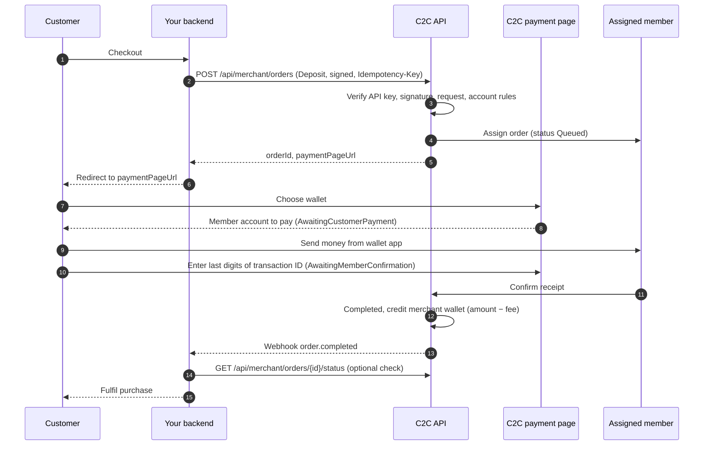
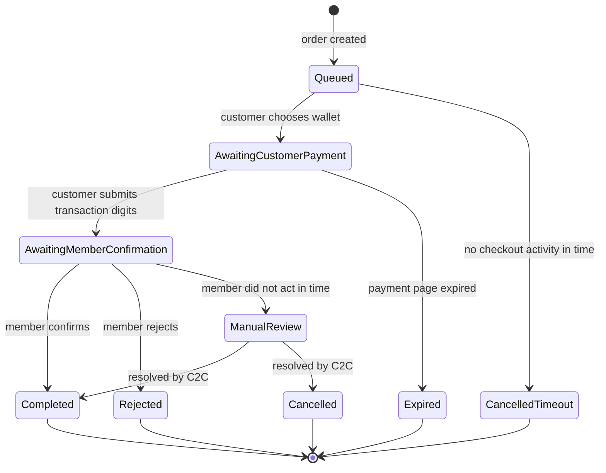

## Overview

A deposit collects money from your customer. The customer pays a verified C2C **member** from their own mobile wallet, the member confirms receipt, and C2C credits your merchant wallet with the amount minus fees.

## Flow diagram



## Step by step

### 1. Create the order

Your backend calls [Create Deposit Order](/api-reference/endpoints/create-deposit) with a signed request and an `Idempotency-Key`. Before creating anything, C2C checks:

1. **API key** valid and active, otherwise `401`
2. **Signature** valid and recent, otherwise `401`. Deposits are always signature-enforced.
3. **Request** valid, otherwise `400`
4. **Merchant account** active and **IP whitelist** passed, otherwise `403`
5. **Wallet channel** enabled for deposits on your account, otherwise `422`
6. An **available member** exists who is online, has an approved account for the wallet, has a limit covering the amount, and has enough balance to back the deposit. Otherwise `422`.

The order is created as `Queued` with the member already assigned, and the member is notified in their app.

### 2. Redirect the customer

Send the customer to `paymentPageUrl` right away. The link is valid for **15 minutes**. See [Hosted payment page](/guides/hosted-payment-page).

### 3. Customer pays

On the page the customer picks a wallet, sees the account to pay, sends the money from their wallet app, and enters the last digits of the transaction ID. The order moves `Queued` → `AwaitingCustomerPayment` → `AwaitingMemberConfirmation`.

### 4. Member confirms

The member checks that the payment arrived:

- **Confirmed** → `Completed`. Your wallet is credited **amount − fee**, and an `order.completed` webhook is sent.
- **Rejected**, for example because no matching payment was found → `Rejected`, and an `order.failed` webhook is sent.

### 5. Fulfil

Fulfil the purchase only when the status is `Completed`. If you set `successUrl` / `failureUrl`, the payment page sends the customer back to you with the outcome appended; still confirm the status server-side before fulfilling. See [Returning the customer](/guides/hosted-payment-page#returning-the-customer-to-your-site).

## Status lifecycle



| Situation | Status | Webhook |
|-----------|--------|---------|
| Member confirms | `Completed` | `order.completed` |
| Member rejects | `Rejected` | `order.failed` |
| Member doesn't confirm in time (the customer may already have paid) | `ManualReview` | `order.failed` (`reason`: `Escalated to manual review`) |
| Customer never opens checkout | `CancelledTimeout` | none, so poll |
| Customer doesn't pay before the page expires | `Expired` | none, so poll |
| C2C resolves a review | `Completed` / `Cancelled` | none, so poll |

## Example: complete deposit integration

<CodeGroup>
```javascript Node.js
// 1. Create the order (signRequest: see the Signature Generation Guide)
async function startDeposit(cart) {
  const path = '/api/merchant/orders';
  const body = JSON.stringify({
    orderType: 'Deposit',
    amount: cart.total,
    currency: 'PKR',
    walletType: 'JazzCash',
    merchantOrderRef: cart.id,
    customerReference: cart.customerId,
  });
  const res = await fetch(BASE_URL + path, {
    method: 'POST',
    headers: {
      'Authorization': `Bearer ${process.env.C2C_API_KEY}`,
      'Content-Type': 'application/json',
      'Idempotency-Key': `${cart.id}-deposit`,
      ...signRequest(process.env.C2C_SIGNING_SECRET, 'POST', path, body),
    },
    body,
  });
  if (!res.ok) throw new Error(`Create deposit failed: HTTP ${res.status} ${await res.text()}`);
  const { data } = await res.json();
  await db.carts.update(cart.id, { c2cOrderId: data.orderId, c2cStatus: data.status });
  return data.paymentPageUrl; // 2. redirect the customer here
}

// 4/5. On webhook or poll: fulfil only on Completed
async function onC2COrderUpdate(orderId) {
  const { status } = await getOrderStatus(orderId); // GET /api/merchant/orders/{id}/status
  const cart = await db.carts.findByC2COrderId(orderId);
  await db.carts.update(cart.id, { c2cStatus: status });
  if ((status === 'Completed' || status === 'Confirmed') && !cart.fulfilled) {
    await fulfil(cart);
  }
}
```

```python Python
import json, os, requests

# sign_request(): see the Signature Generation Guide
def start_deposit(cart) -> str:
    path = "/api/merchant/orders"
    body = json.dumps({
        "orderType": "Deposit",
        "amount": cart.total,
        "currency": "PKR",
        "walletType": "JazzCash",
        "merchantOrderRef": cart.id,
        "customerReference": cart.customer_id,
    }, separators=(",", ":"))
    res = requests.post(BASE_URL + path, data=body.encode("utf-8"), headers={
        "Authorization": f"Bearer {os.environ['C2C_API_KEY']}",
        "Content-Type": "application/json",
        "Idempotency-Key": f"{cart.id}-deposit",
        **sign_request(os.environ["C2C_SIGNING_SECRET"], "POST", path, body),
    })
    res.raise_for_status()
    data = res.json()["data"]
    db.save_c2c_order(cart.id, data["orderId"], data["status"])
    return data["paymentPageUrl"]  # redirect the customer here


def on_c2c_order_update(order_id: str) -> None:
    status = get_order_status(order_id)["status"]
    cart = db.cart_by_c2c_order(order_id)
    db.set_c2c_status(cart.id, status)
    if status in ("Completed", "Confirmed") and not cart.fulfilled:
        fulfil(cart)
```
</CodeGroup>

## Best practices

- **Store `orderId` and your `Idempotency-Key`** with your order before you redirect.
- **Use webhooks and reconcile:** some outcomes (expiry, timeout, review resolution) send no webhook.
- **Don't fulfil early:** `Queued`, `AwaitingCustomerPayment` and `AwaitingMemberConfirmation` are all in-progress states.
- **Treat `ManualReview` as pending.** The customer may have paid, so don't ask them to pay again until C2C resolves it.
- **Handle `422` gracefully:** "no eligible member" is temporary. Offer another wallet or ask the customer to retry shortly.
