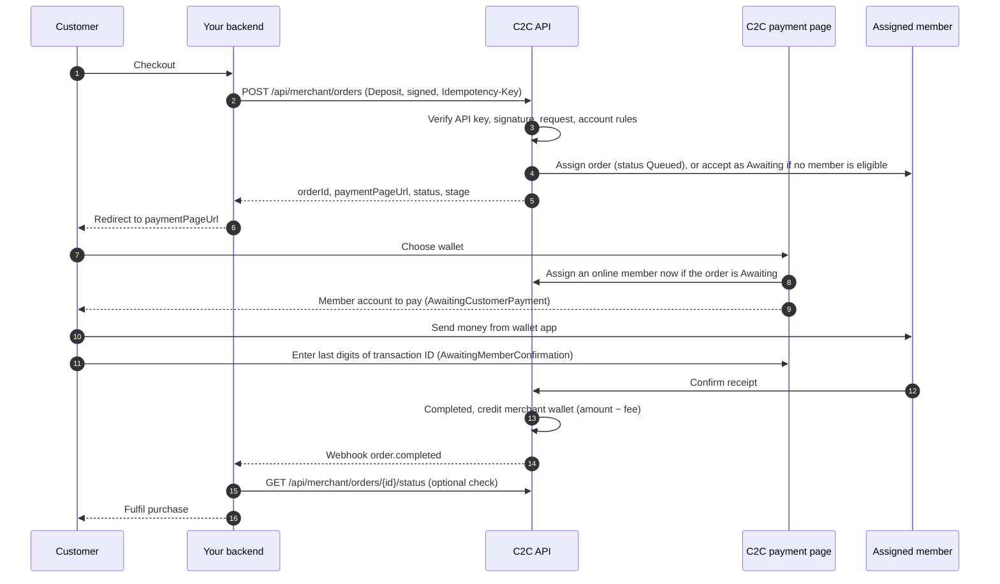
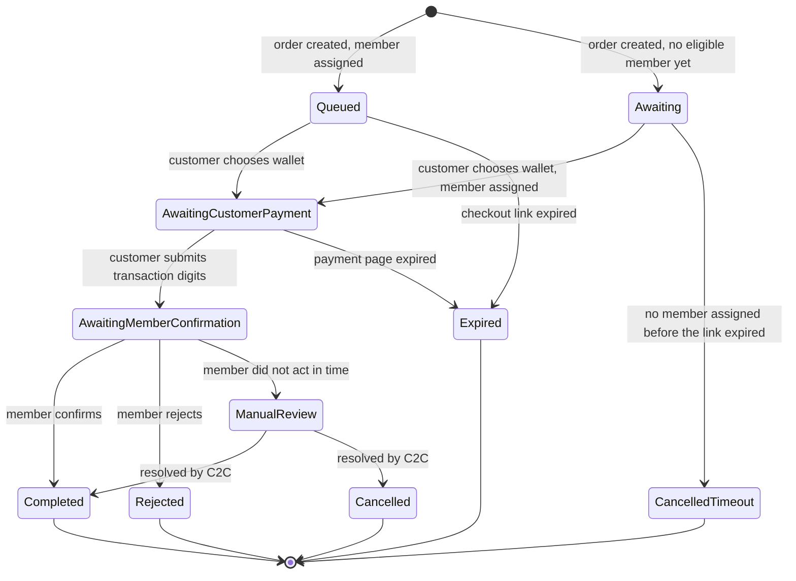

## Overview

A deposit collects money from your customer. The customer pays a verified C2C **member** from their own mobile wallet, the member confirms receipt, and C2C credits your merchant wallet with the amount minus fees.

## Flow diagram



## Step by step

### 1. Create the order

Your backend calls [Create Deposit Order](/api-reference/endpoints/create-deposit) with a signed request and an `Idempotency-Key`. Before creating anything, C2C checks:

1. **API key** valid and active, otherwise `401`
2. **Signature** (the body's `signature` field) valid, otherwise `401`. Deposits are always signature-enforced.
3. **Request** valid, otherwise `400`
4. **Merchant account** active and **IP whitelist** passed, otherwise `403`
5. **Wallet channel** enabled for deposits on your account, otherwise `422`
6. **`merchantOrderRef`** not already used by an order that is in progress or completed, otherwise `409`. See [`merchantOrderRef` rules](/guides/order-status#merchantorderref-rules).

C2C then looks for an **eligible member**: online, with an approved account for the wallet, a limit covering the amount, and enough balance to back the deposit.

- **Member found:** the order is created as `Queued` (stage `Assigned`) with the member already assigned, and the member is notified in their app.
- **No member right now:** the order is still **accepted** (`200`) as `Awaiting` (stage `Awaiting`), with the usual `orderId`, `orderReference` and `paymentPageUrl`. A member is assigned when the customer picks a wallet on the payment page.

Your merchant fee is fixed when the order is accepted. It's re-quoted only if the customer pays with a different wallet type than you requested, and it's capped at the deposit amount, so the credit to your wallet is never negative. Later fee-rule changes apply to new orders only.

### 2. Redirect the customer

Send the customer to `paymentPageUrl` right away. The link is valid for **15 minutes**. See [Hosted payment page](/guides/hosted-payment-page).

### 3. Customer pays

On the page the customer picks a wallet, sees the account to pay, sends the money from their wallet app, and enters the last digits of the transaction ID. The order moves `Queued` (or `Awaiting`) → `AwaitingCustomerPayment` → `AwaitingMemberConfirmation`.

For an `Awaiting` order, an online member is assigned as soon as the customer picks a wallet, and their account is shown. If nobody is online yet, the page shows **"Finding an available agent…"** and re-checks automatically every 10 seconds. The customer must not send money until an account is shown.

### 4. Member confirms

The member checks that the payment arrived:

- **Confirmed** → `Completed`. Your wallet is credited **amount − fee**, and an `order.completed` webhook is sent.
- **Rejected**, for example because no matching payment was found → `Rejected`, and an `order.failed` webhook is sent.

### 5. Fulfil

Fulfil the purchase only when the status is `Completed`. If you set `successUrl` / `failureUrl`, the payment page sends the customer back to you with the outcome appended; still confirm the status server-side before fulfilling. See [Returning the customer](/guides/hosted-payment-page#returning-the-customer-to-your-site).

## Status lifecycle



| Situation | Status | Webhook |
|-----------|--------|---------|
| Member confirms | `Completed` | `order.completed` |
| Member rejects | `Rejected` | `order.failed` |
| Member doesn't confirm in time (the customer may already have paid) | `ManualReview` | none until resolved, so poll |
| Customer never opens checkout, or doesn't pay before the link expires (15 minutes) | `Expired` | `order.failed` (`reason`: `Checkout expired before payment`) |
| No member could be assigned before the link expired (`Awaiting` order) | `CancelledTimeout` | `order.failed` (`reason`: `No eligible member became available in time`) |
| C2C resolves a review | `Completed` / `Cancelled` | `order.completed` / `order.failed` |

## Example: complete deposit integration

<CodeGroup>
```javascript Node.js
// 1. Create the order (signBody: see the Signature Generation Guide)
async function startDeposit(cart) {
  const payload = {
    orderType: 'Deposit',
    amount: cart.total,
    currency: 'PKR',
    walletType: 'JazzCash',
    merchantOrderRef: cart.id,
    customerReference: cart.customerId,
    callbackUrl: 'https://merchant.example.com/webhooks/c2c',
  };
  const res = await fetch(`${BASE_URL}/api/merchant/orders`, {
    method: 'POST',
    headers: {
      'C2C-API-Key': process.env.C2C_API_KEY,
      'Content-Type': 'application/json',
      'Idempotency-Key': `${cart.id}-deposit`,
    },
    body: JSON.stringify({ ...payload, signature: signBody(payload, process.env.C2C_SIGNING_SECRET) }),
  });
  if (!res.ok) throw new Error(`Create deposit failed: HTTP ${res.status} ${await res.text()}`);
  const { data } = await res.json();
  await db.carts.update(cart.id, { c2cOrderId: data.orderId, c2cStatus: data.status });
  return data.paymentPageUrl; // 2. redirect the customer here
}

// 4/5. On webhook or poll: fulfil only on Completed
async function onC2COrderUpdate(orderId) {
  const { status } = await getOrderStatus(orderId); // GET /api/merchant/orders/{id}/status
  const cart = await db.carts.findByC2COrderId(orderId);
  await db.carts.update(cart.id, { c2cStatus: status });
  if ((status === 'Completed' || status === 'Confirmed') && !cart.fulfilled) {
    await fulfil(cart);
  }
}
```

```python Python
import os, requests

# sign_body(): see the Signature Generation Guide
def start_deposit(cart) -> str:
    payload = {
        "orderType": "Deposit",
        "amount": cart.total,
        "currency": "PKR",
        "walletType": "JazzCash",
        "merchantOrderRef": cart.id,
        "customerReference": cart.customer_id,
        "callbackUrl": "https://merchant.example.com/webhooks/c2c",
    }
    res = requests.post(
        f"{BASE_URL}/api/merchant/orders",
        json={**payload, "signature": sign_body(payload, os.environ["C2C_SIGNING_SECRET"])},
        headers={
            "C2C-API-Key": os.environ["C2C_API_KEY"],
            "Idempotency-Key": f"{cart.id}-deposit",
        },
    )
    res.raise_for_status()
    data = res.json()["data"]
    db.save_c2c_order(cart.id, data["orderId"], data["status"])
    return data["paymentPageUrl"]  # redirect the customer here


def on_c2c_order_update(order_id: str) -> None:
    status = get_order_status(order_id)["status"]
    cart = db.cart_by_c2c_order(order_id)
    db.set_c2c_status(cart.id, status)
    if status in ("Completed", "Confirmed") and not cart.fulfilled:
        fulfil(cart)
```
</CodeGroup>

## Best practices

- **Store `orderId` and your `Idempotency-Key`** with your order before you redirect.
- **Use webhooks and reconcile:** every final outcome sends a webhook, but `ManualReview` doesn't until it's resolved, and deliveries can fail.
- **Don't fulfil early:** `Awaiting`, `Queued`, `AwaitingCustomerPayment` and `AwaitingMemberConfirmation` are all in-progress states.
- **Redirect `Awaiting` orders as usual.** The payment page assigns a member when the customer picks a wallet.
- **Treat `ManualReview` as pending.** The customer may have paid, so don't ask them to pay again until C2C resolves it.
- **One live order per `merchantOrderRef`.** To let the customer try again after a failed order, create a new order (new `Idempotency-Key`); you can reuse the same `merchantOrderRef`.
