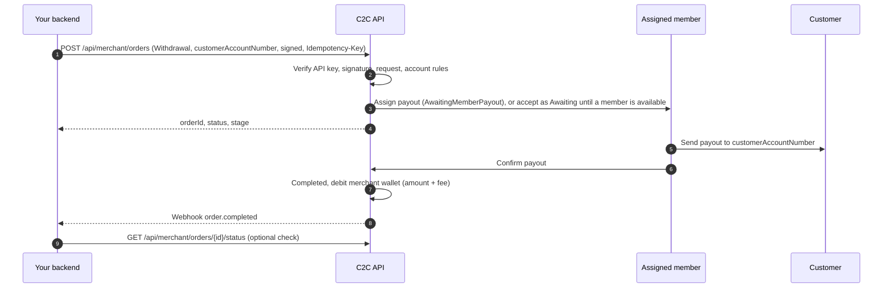
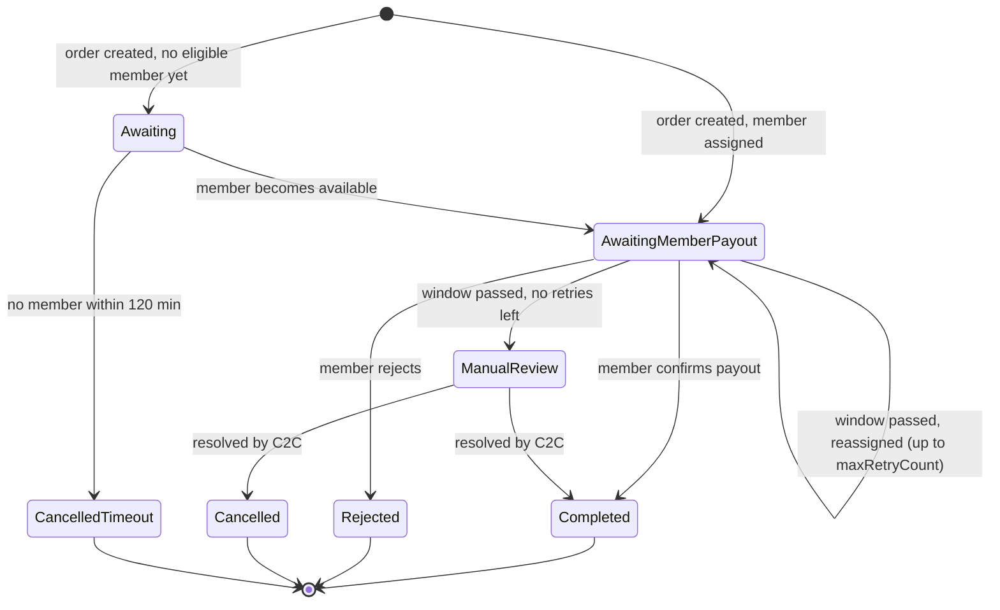

## Overview

A withdrawal pays money **to** your customer. C2C assigns a member who sends the payout from their own account to the customer's account. When the member confirms, C2C debits your merchant wallet by the **amount plus fee**.

There is no customer-facing page in this flow: you supply the customer's receiving account when you create the order.

## Flow diagram



## Step by step

### 1. Check your balance

Call [Query wallet balance](/api-reference/endpoints/query-balance). C2C accepts a withdrawal only if your available balance covers its **amount + fee** plus every withdrawal still in progress; otherwise it returns `422 Insufficient merchant balance`. The debit itself happens when the payout is **confirmed**. See the [funding check](/api-reference/endpoints/create-withdrawal#funding-check).

### 2. Create the order

Call [Create Withdrawal Order](/api-reference/endpoints/create-withdrawal) with:

- `orderType: "Withdrawal"`
- `walletType`: the customer's receiving wallet or account type
- `customerAccountNumber`: where to send the money
- `amount`, optional `currency`, `merchantOrderRef`, `callbackUrl`, `maxRetryCount`
- a unique `Idempotency-Key` and a valid `signature` field. Withdrawals are always signature-enforced, and the signature covers the account number and amount, so they can't be changed in transit.

C2C runs the same checks as for deposits: API key, signature, validation, active account, IP whitelist, channel enabled, and a `merchantOrderRef` that isn't already used by a payout in progress or completed (`409`). It also runs the **funding check**: your available balance must cover this payout and every payout in progress, including fees. The fee is fixed when the order is accepted; later fee-rule changes apply to new orders only.

C2C then looks for an available member with a matching account whose limit covers the amount:

- **Member found:** the order starts in `AwaitingMemberPayout` (stage `Assigned`).
- **No member right now:** the order is still **accepted** as `Awaiting` (stage `Awaiting`). It's assigned automatically as soon as a member becomes available: a member comes online, a member frees capacity, or C2C's once-a-minute background check finds one. While `Awaiting`, its **amount + fee stays reserved** against your balance (it counts as in progress for the funding check and for the Pending amount on your dashboard). If no member becomes available within **120 minutes** (a platform setting), the order ends `CancelledTimeout`.

### 3. Member pays out

Once assigned, the order is in `AwaitingMemberPayout`. The member sees the customer's account and amount in their app, sends the payout, and confirms it.

### 4. Outcome

| What happens | Status | Webhook | Your wallet |
|--------------|--------|---------|-------------|
| Member confirms the payout | `Completed` | `order.completed` | − (amount + fee) |
| Member rejects the order | `Rejected` | `order.failed` | unchanged |
| Payout window (60 min by default) passes, retries left | stays `AwaitingMemberPayout`, reassigned to another member | none | unchanged |
| Payout window passes, `maxRetryCount` reached | `ManualReview` | none until resolved | unchanged until resolved |
| C2C resolves a review | `Completed` / `Cancelled` | `order.completed` / `order.failed` | per outcome |
| No member available within 120 minutes (`Awaiting` order) | `CancelledTimeout` | `order.failed` (`reason`: `No eligible member became available in time`) | unchanged, reservation released |

## Status lifecycle



## Example

<CodeGroup>
```javascript Node.js
// signBody(): see the Signature Generation Guide
async function payOut(payout) {
  const payload = {
    orderType: 'Withdrawal',
    amount: payout.amount,
    currency: 'PKR',
    walletType: payout.walletType,                 // e.g. 'Easypaisa'
    customerAccountNumber: payout.accountNumber,   // validated on your side
    merchantOrderRef: payout.id,
    customerReference: payout.customerId,
    callbackUrl: 'https://merchant.example.com/webhooks/c2c',
  };

  const res = await fetch(`${BASE_URL}/api/merchant/orders`, {
    method: 'POST',
    headers: {
      'C2C-API-Key': process.env.C2C_API_KEY,
      'Content-Type': 'application/json',
      'Idempotency-Key': `payout-${payout.id}`,     // one key per payout, reused on every retry
    },
    body: JSON.stringify({ ...payload, signature: signBody(payload, process.env.C2C_SIGNING_SECRET) }),
  });
  if (!res.ok) throw new Error(`Create withdrawal failed: HTTP ${res.status} ${await res.text()}`);
  const { data } = await res.json();
  await db.payouts.update(payout.id, { c2cOrderId: data.orderId, status: 'processing' });
}
```

```python Python
import os, requests

# sign_body(): see the Signature Generation Guide
def pay_out(payout) -> None:
    payload = {
        "orderType": "Withdrawal",
        "amount": payout.amount,
        "currency": "PKR",
        "walletType": payout.wallet_type,
        "customerAccountNumber": payout.account_number,
        "merchantOrderRef": payout.id,
        "customerReference": payout.customer_id,
        "callbackUrl": "https://merchant.example.com/webhooks/c2c",
    }
    res = requests.post(
        f"{BASE_URL}/api/merchant/orders",
        json={**payload, "signature": sign_body(payload, os.environ["C2C_SIGNING_SECRET"])},
        headers={
            "C2C-API-Key": os.environ["C2C_API_KEY"],
            "Idempotency-Key": f"payout-{payout.id}",
        },
    )
    res.raise_for_status()
    db.mark_payout_processing(payout.id, res.json()["data"]["orderId"])
```
</CodeGroup>

## Business rules and best practices

- **One `Idempotency-Key` per payout, forever.** Never create a new key to "retry" a payout that is still in progress or in `ManualReview`. That is how double payouts happen.
- **Validate account numbers** before submitting. C2C sends funds to the account you provide.
- **Mark the payout as paid only on `Completed`.**
- **`Rejected` is final:** no money was sent and your wallet isn't debited, so you can create a new withdrawal with a new key if appropriate.
- **`Awaiting` is in progress, not failed.** Don't resubmit the payout; it's assigned automatically or ends `CancelledTimeout` after 120 minutes.
- **One live order per `merchantOrderRef`.** You can reuse a reference only after its earlier payout failed.
- **Reconcile** orders that stay in `Awaiting`, `AwaitingMemberPayout` or `ManualReview` longer than expected.
