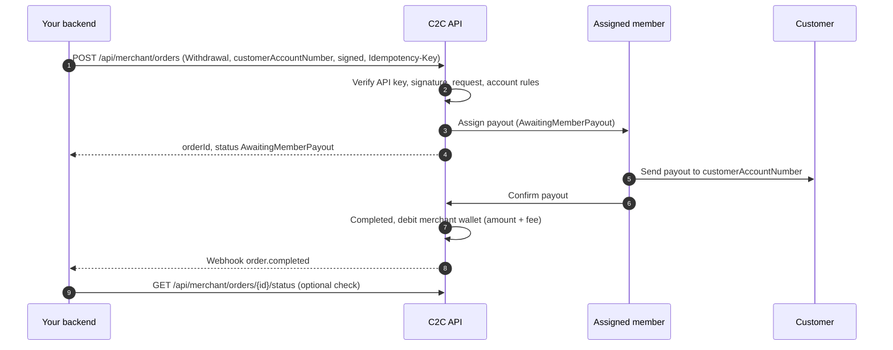
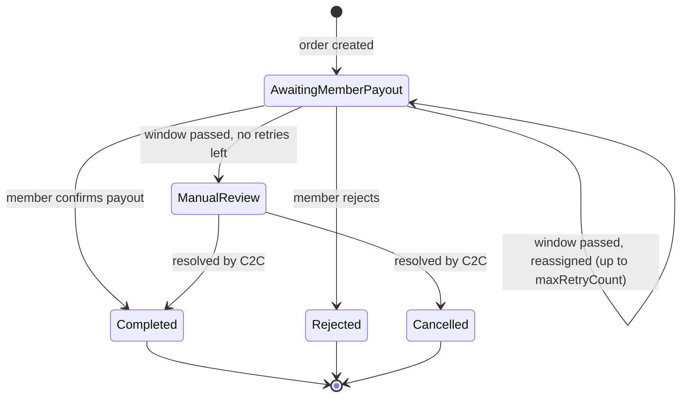

## Overview

A withdrawal pays money **to** your customer. C2C assigns a member who sends the payout from their own account to the customer's account. When the member confirms, C2C debits your merchant wallet by the **amount plus fee**.

There is no customer-facing page in this flow: you supply the customer's receiving account when you create the order.

## Flow diagram



## Step by step

### 1. Check your balance

Call [Query wallet balance](/api-reference/endpoints/query-balance). C2C accepts a withdrawal only if your available balance covers its **amount + fee** plus every withdrawal still in progress; otherwise it returns `422 Insufficient merchant balance`. The debit itself happens when the payout is **confirmed**. See the [funding check](/api-reference/endpoints/create-withdrawal#funding-check).

### 2. Create the order

Call [Create Withdrawal Order](/api-reference/endpoints/create-withdrawal) with:

- `orderType: "Withdrawal"`
- `walletType`: the customer's receiving wallet or account type
- `customerAccountNumber`: where to send the money
- `amount`, optional `currency`, `merchantOrderRef`, `callbackUrl`, `maxRetryCount`
- a unique `Idempotency-Key` and a valid signature. Withdrawals are always signature-enforced, and the signature protects the account number and amount from tampering.

C2C runs the same checks as for deposits: API key, signature, validation, active account, IP whitelist, channel enabled, and an available member with a matching account whose limit covers the amount. It also runs the **funding check**: your available balance must cover this payout and every payout in progress, including fees.

### 3. Member pays out

The order starts in `AwaitingMemberPayout`. The member sees the customer's account and amount in their app, sends the payout, and confirms it.

### 4. Outcome

| What happens | Status | Webhook | Your wallet |
|--------------|--------|---------|-------------|
| Member confirms the payout | `Completed` | `order.completed` | − (amount + fee) |
| Member rejects the order | `Rejected` | `order.failed` | unchanged |
| Payout window (60 min by default) passes, retries left | stays `AwaitingMemberPayout`, reassigned to another member | none | unchanged |
| Payout window passes, `maxRetryCount` reached | `ManualReview` | `order.failed` (`reason`: `Escalated to manual review`) | unchanged until resolved |
| C2C resolves a review | `Completed` / `Cancelled` | none, so poll | per outcome |

## Status lifecycle



## Example

<CodeGroup>
```javascript Node.js
// signRequest(): see the Signature Generation Guide
async function payOut(payout) {
  const path = '/api/merchant/orders';
  const body = JSON.stringify({
    orderType: 'Withdrawal',
    amount: payout.amount,
    currency: 'PKR',
    walletType: payout.walletType,                 // e.g. 'Easypaisa'
    customerAccountNumber: payout.accountNumber,   // validated on your side
    merchantOrderRef: payout.id,
    customerReference: payout.customerId,
  });

  const res = await fetch(BASE_URL + path, {
    method: 'POST',
    headers: {
      'Authorization': `Bearer ${process.env.C2C_API_KEY}`,
      'Content-Type': 'application/json',
      'Idempotency-Key': `payout-${payout.id}`,     // one key per payout, reused on every retry
      ...signRequest(process.env.C2C_SIGNING_SECRET, 'POST', path, body),
    },
    body,
  });
  if (!res.ok) throw new Error(`Create withdrawal failed: HTTP ${res.status} ${await res.text()}`);
  const { data } = await res.json();
  await db.payouts.update(payout.id, { c2cOrderId: data.orderId, status: 'processing' });
}
```

```python Python
import json, os, requests

# sign_request(): see the Signature Generation Guide
def pay_out(payout) -> None:
    path = "/api/merchant/orders"
    body = json.dumps({
        "orderType": "Withdrawal",
        "amount": payout.amount,
        "currency": "PKR",
        "walletType": payout.wallet_type,
        "customerAccountNumber": payout.account_number,
        "merchantOrderRef": payout.id,
        "customerReference": payout.customer_id,
    }, separators=(",", ":"))
    res = requests.post(BASE_URL + path, data=body.encode("utf-8"), headers={
        "Authorization": f"Bearer {os.environ['C2C_API_KEY']}",
        "Content-Type": "application/json",
        "Idempotency-Key": f"payout-{payout.id}",
        **sign_request(os.environ["C2C_SIGNING_SECRET"], "POST", path, body),
    })
    res.raise_for_status()
    db.mark_payout_processing(payout.id, res.json()["data"]["orderId"])
```
</CodeGroup>

## Business rules and best practices

- **One `Idempotency-Key` per payout, forever.** Never create a new key to "retry" a payout that is still in progress or in `ManualReview`. That is how double payouts happen.
- **Validate account numbers** before submitting. C2C sends funds to the account you provide.
- **Mark the payout as paid only on `Completed`.**
- **`Rejected` is final:** no money was sent and your wallet isn't debited, so you can create a new withdrawal with a new key if appropriate.
- **Reconcile** orders that stay in `AwaitingMemberPayout` or `ManualReview` longer than expected.
