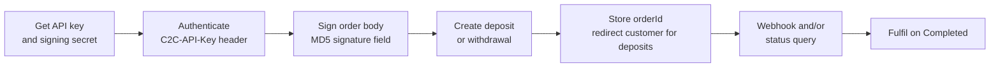

## What C2C does

C2C connects your platform to a network of **verified members** who hold JazzCash, Easypaisa, Till ID and bank accounts. For every order, C2C assigns an available member with a matching account:

- **Deposits:** your customer pays the member's account through a C2C-hosted payment page. The member confirms receipt, and your merchant wallet is credited.
- **Withdrawals:** the member pays your customer's account. When the payout is confirmed, your merchant wallet is debited.

Your backend talks to one API, and C2C handles member assignment, payment instructions, confirmation and settlement to your merchant wallet.

## How an integration works

<CardGroup cols={2}>
  <Card title="Quickstart" icon="rocket" href="/quickstart">
    Your first signed deposit, end to end
  </Card>
  <Card title="API reference" icon="code" href="/api-reference/introduction">
    Endpoints, fields, responses and errors
  </Card>
  <Card title="Signature Generation Guide" icon="signature" href="/api-reference/signature-guide">
    Required for deposits and withdrawals. Code in C#, Node.js and Python.
  </Card>
  <Card title="Webhooks" icon="webhook" href="/guides/webhooks">
    Signed callbacks when orders complete or fail
  </Card>
</CardGroup>

## Core business processes

<CardGroup cols={2}>
  <Card title="Deposit flow" icon="arrow-down-to-line" href="/guides/deposit-flow">
    Collect payments through the hosted payment page
  </Card>
  <Card title="Withdrawal flow" icon="arrow-up-from-line" href="/guides/withdrawal-flow">
    Pay customers out to their own wallet
  </Card>
  <Card title="Hosted payment page" icon="window-maximize" href="/guides/hosted-payment-page">
    What your customer sees during a deposit
  </Card>
  <Card title="Order status & tracking" icon="list-check" href="/guides/order-status">
    Statuses, identifiers and reliable outcome tracking
  </Card>
</CardGroup>

## At a glance

| | |
|---|---|
| **Style** | REST, JSON, HTTPS |
| **Authentication** | `C2C-API-Key: mk_live_...` header (`Authorization: Bearer` also accepted) |
| **Request signing** | MD5 `signature` field in the body. Always enforced for deposits and withdrawals. |
| **Idempotency** | `Idempotency-Key` header required on order creation |
| **Wallets** | JazzCash, Easypaisa, Till ID, bank account (enabled per merchant) |
| **Currencies** | PKR (default), INR, BDT |
| **Notifications** | Webhooks `order.completed` / `order.failed` + status polling |
| **Rate limits** | None on the Merchant API |

## Need help?

Email [support@c2cplatform.com](mailto:support@c2cplatform.com) and include the `traceId` from any error response.
